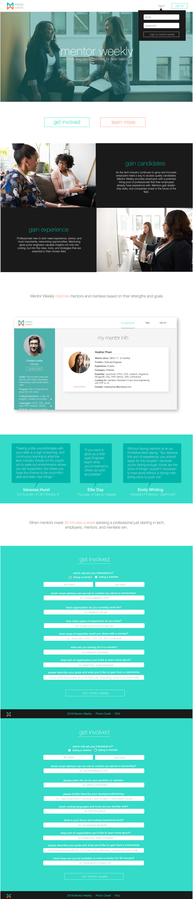
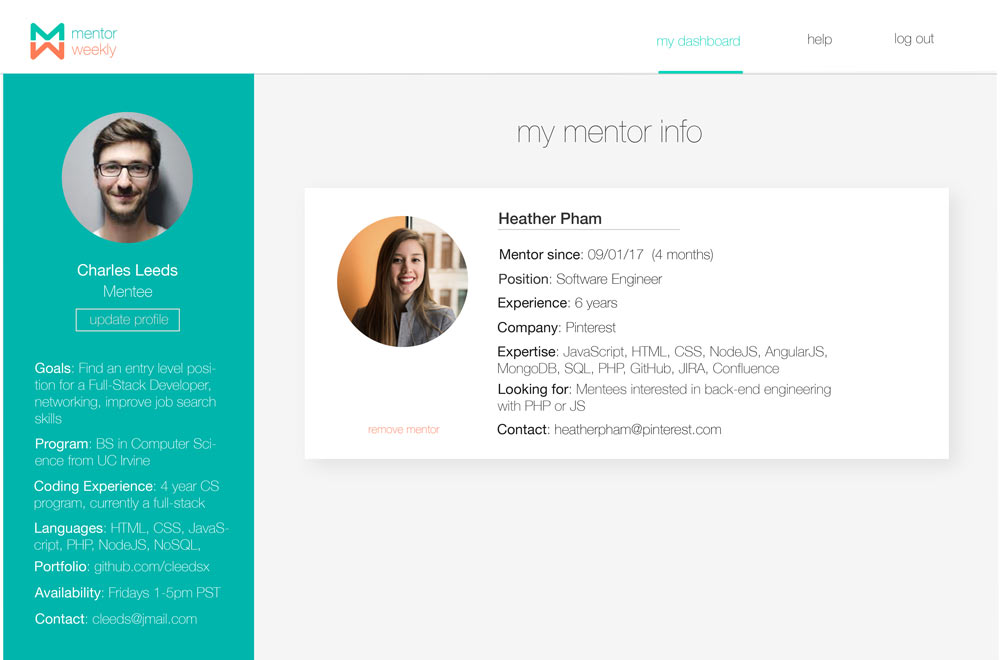
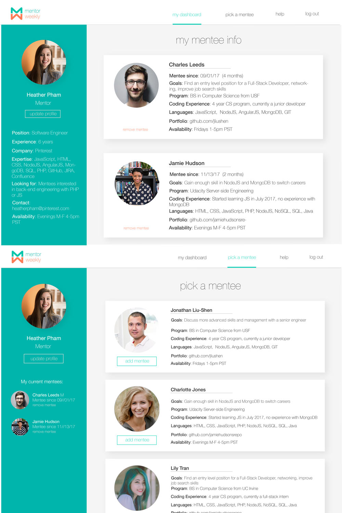
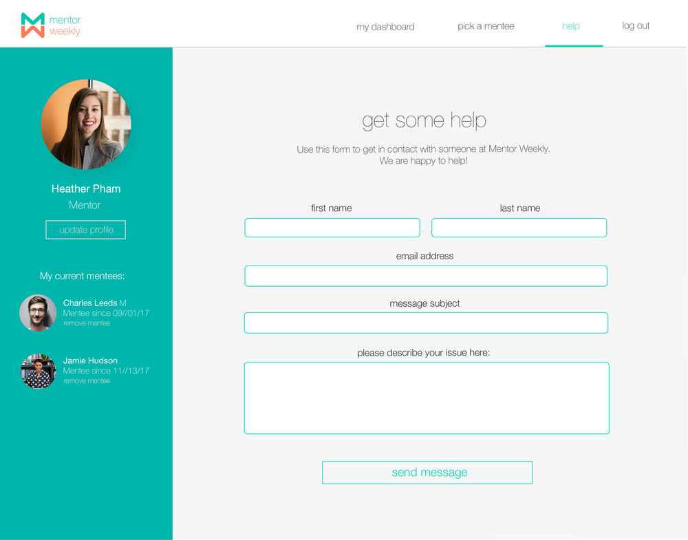

# Mentor Weekly

[Mentor Weekly](https://mentor-weekly.now.sh/) is a free platform that connects tech mentors to up-and-coming engineers.
Try the live demo at https://mentor-weekly.now.sh/.
Demo login: _mentorweeklydemo@gmail.com_
Password: _password_

## Technologies Used

Mentor Weekly was built with React, NodeJS, and Express. The project also uses images created in Adobe Illustrator, emails using SendGrid, authorization with Auth0, and tested with Enzyme, Jest, and Mocha/Chai libraries.

This project uses [Next.js](https://github.com/zeit/next.js/) and was deployed with [now](https://zeit.co/now).

## Development Setup:

* npm install
* source .env
* npm run dev

## Mockups

### Landing Page:

### Mentee Dashboard:

### Mentor Dashboard:

### Help Page:

