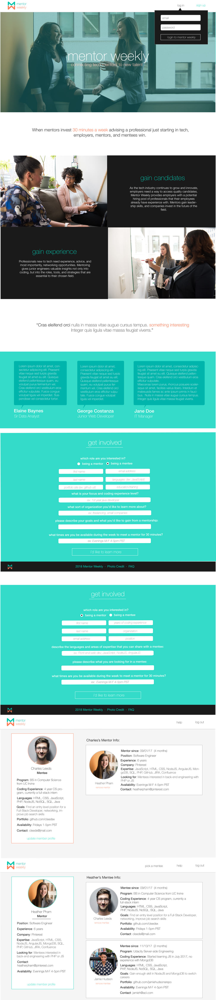

# Mentor Weekly

Mentor Weekly connects tech mentors to junior engineers.

## Technologies Used

Mentor Weekly was built with React and NodeJS. The project also uses images created in Adobe Illustrator.

This project uses Next.js.
Check out [this repo](https://github.com/zeit/next.js/) to learn how to develop with Next.js

## Mocks

